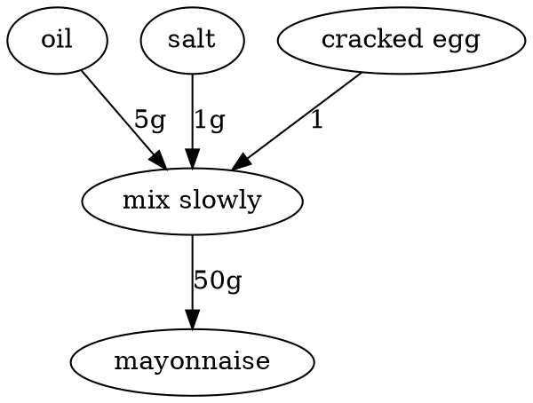

Omnomnivore
===========

Delicious graph-powered recipe planner|maker|

# What's in the box?

[How to use this]

# Development

Development takes place on Linux. The easiest way to get started is with Nix.

We use Podman to containerise a graph DB.

# How it works

    
User requests recipe: burger with fries

    sub-recipe: burger
    sub-recipe: fries
    sub-recipe: magic dip (bbq sauce + mayonnaise)
        sub-recipe: bbq sauce (ingredient: bbq sauce, terminal)
        sub-recipe: mayonnaise (ingredient: mayonnaise, make your own)
            we are requesting 20 g of mayonnaise
                -> mayonnaise consumes egg, oil, ...
                -> how much egg for 20 g?
                -> how much oil for 20 g?
                -> how much salt for 20 g?

Example step

Step(mix mayonnaise)
- consume: [1, 0] (cracked egg)
- consume: [20 g, 0] (mustard)
- consume: [3 g, 0] (salt)
- consume: [3 g, 0] (sugar)
- consume: [200 ml, 0] (sunflower oil)
- produce: 150 g (mayonnaise)

User Story: Ask for a specific quantity

    Ask for: 200 g of (mayonnaise)

    cracked egg <--- consumes(1)     --- Step(mix slowly) --- produces ---> Ingredient(mayonnaise)(20 g, mass)
            oil <--- consumes(20 ml) --/
        salt <--- consumse(0.5 g) --/

User Story: Ask for a recipe with specific categories ('romantic, 'vegetarian')

    Recipe: (romantic vegetarian dinner on a budget of 40,- Fr) for (2)
    - buy(Hiltl, main menu, 2x)
    - buy(candles, 4x)
    - buy(wine bottle, 1x)
 

## Recipe
- A user always requests a recipe, nothing else
- Recipes can be nested
- A container for a set of concrete ingredients, with all their dependencies fulfilled
- Some dependencies need choices, e.g. "what kind of milk?"
- For each final step, a quantity is provided
- For each ingredient, the information about its terminality is provided (are we making it from scratch, or using store-bought?)

## Categories
- For example: "coffee beans", "ground coffee", ...
- For example: "bread" (white, dark, corn, ...)
- For example: "lunch"
- For example: "oil"

## Ingredient (node)
- An ingredient is either terminal (e.g. water) or composite (e.g. full meal)
- Each ingredient has a name
- An ingredient has an intrinsic physical quantitification: mass (divisible), volume (divisible), or quantity (indivisible)
   - we do not discriminate between units of mass or volume

## Step (node)
- A step consumes ingredients
- A step produces ingredients
- A step does not have an intrinsic quantity, but rather expects a quantity to be asked of it (e.g. 2 cracked eggs)
- The requested quantity is then passed to the dependencies it consumes (e.g. 2 cracked eggs require 2 whole eggs)

    
An example user story for step search

    Ingredient: sandwich (node, quantification: quantity)
        user asks for 1 sandwich
        -> we need to provide 1 sandwich
        -> we look for steps(!) that directly provide 1 sandwich
        -> we find step: "assemble the sandwich"
        -> this step consumes "X slices of bread" "Y slices ham" "Z slices cheese" ... "W grams of mayonnaise"

## Consumes (edge)
- The relation consumes exists only between step and ingredient (step consumes zero or more ingredients)
- Specifies, how much is consumed by default, with unit
- A 'consumes' edge, needs a relationship ax + b, where [a, b] are properties, and x is the produced amount

## Produces (edge)
- The relation consumes exists only between step and ingredient (step produces one or more ingredients)
- Specifies, how much is procuded by default, with unit

# Roadmap

0. Talk to graph DB
1. Add ingredient and step nodes, with ability to CRUD them in the DB
2. Add consumes and produces edges, with ability to CRUD them in the DB
3. Add Servant REST API for ingredients, steps, and edges
4. Query an ingredient, get full subgraph as JSON
5. Query a certain amount of an ingredient, calculate / scale all the dependencies, do not divide undivisible ones (round up!)
6. Add basic support for recipes: set of ingredients + step choices
7. Add categories (tbd)

# Licence

Apache License, Version 2.0